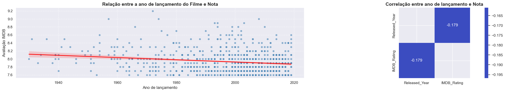
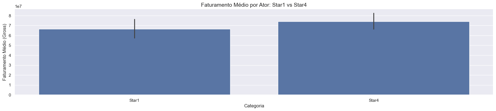
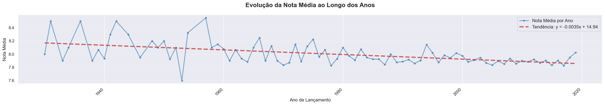
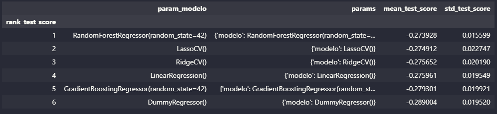

# Como executar o projeto:

### Clonar o repositório: git clone https://github.com/leonardonassibfonseca/case_indicium.git

### Entrar na pasta do projeto: cd case_indicium

### Instalar dependências (desenvolvido em Python 3.11): pip install -r requirements.txt

### Abrir o Jupyter Notebook: jupyter notebook

# Case Indicium: Estúdio de Hollywood chamado PProductions

Qual deverá ser o próximo lançamento cinematográfico da PProductions?

## 1.	Problema de negócio
Este projeto apresenta uma análise abrangente do banco de dados cinematográfico com o objetivo de orientar a decisão estratégica sobre o próximo filme a ser desenvolvido pela PProductions. A abordagem combina análise exploratória de dados, modelagem preditiva e considerações de mercado para maximizar o potencial de sucesso financeiro e crítico.

## 2.	Objetivo
Orientar a PProductions sobre qual tipo de filme desenvolver a seguir, usando análise de dados e modelagem preditiva para maximizar o sucesso comercial e crítico.

## 3.	Premissas do negócio
Seguem abaixo as premissas para as variáveis abaixo: 

Interpretação da coluna Certificate (faixa etária)
 
Sistema Americano (MPAA - Motion Picture Association)

**G** - General Audiences: Todas as idades admitidas

**PG** - Parental Guidance Suggested: Algum material pode não ser adequado para crianças

**PG-13** - Parents Strongly Cautioned: Algum material pode ser inadequado para menores de 13 anos

**R** - Restricted: Menores de 17 anos requerem acompanhante adulto

**NC-17** - Adults Only: Apenas adultos (não aparece na sua lista)

fonte: https://www.motionpictures.org/film-ratings/

Sistema Indiano (CBFC - Central Board of Film Certification)

**U** - Unrestricted Public Exhibition: Para todas as idades

**UA** - Unrestricted Public Exhibition with caution: Para todas as idades, mas com aviso parental

**A** - Adults Only: Apenas para adultos (18+)

fonte: https://www.cbfcindia.gov.in/cbfcAdmin/

Sistema Britânico (BBFC - antigo)

**U** - Universal: Para todas as idades

**A** - Adult: Para adultos (histórico, não usado mais)

**U/A** - Provavelmente variação do sistema indiano

fonte: https://www.bbfc.co.uk/

Classificação de TV

**TV-PG** - Parental Guidance Suggested: Programa de TV com orientação parental

fonte: https://www.tvguidelines.org/

Classificações Históricas (Antigas)

**Passed** - Sistema antigo dos EUA (pré-1968): Filme aprovado sem restrições específicas

**Approved** - Similar a "Passed", indica aprovação para exibição

**GP** - General Public: Antiga classificação similar à PG (1970-1972)

fonte: https://www.filmsite.org/rating.html

## 4.	Estratégia adotada para solução

**Passo 1 - Descrição dos dados:** O objetivo deste passo é ter um entendimento inicial de como os dados estão relacionados com o problema de negócio proposto.

**Passo 2 - Engenharia de variáveis:** Neste passo serão criadas hipóteses relativas ao negócio e também se necessário, poderão ser criadas novas variáveis a partir das variáveis originais a fim de melhorar a qualidade dos dados facilitando seu o entendimento.

**Passo 3 - Filtragem das variáveis:** Nesta etapa, é realizada a filtragem das variáveis com base nas restrições do negócio, ou seja, isso significa verificar se todas as variáveis essenciais estarão disponíveis na base de dados, garantindo que as informações necessárias para o modelo ou análise estejam presentes e possam ser acessadas durante a produção. Essa verificação é crucial para evitar erros futuros e assegurar que o sistema funcione corretamente quando for implementado em um ambiente de produção. Além disso, podemos identificar variáveis redundantes ou irrelevantes, que podem ser removidas para otimizar o desempenho.
 
**Passo 4 - Análise exploratória:** A análise exploratória dos dados (EDA) tem como principal objetivo proporcionar uma compreensão mais aprofundada dos dados, tais como: Compreender a distribuição das variáveis numéricas e categóricas, identificar outliers (valores atípicos), correlações entre  as variáveis entre outras análises.

**Passo 5 - Preparação dos dados:** Neste tópico, os dados poderão ser transformados, ou seja, as variáveis categóricas poderão ser convertidas em números, as variáveis numéricas poderão ser reescalados, em outras palavras, colocadas em uma escala comum. Também neste passo, serão testados os algoritmos de machine learning para avaliação.
 
**Passo 6 - Conclusão.**

## 5.	Top 3 insights
**Hipótese 1:** Filmes mais recentes têm notas mais altas?.

**Falsa:** Não existe uma correlação positiva e sim uma negativa (0,179), ou seja, quanto mais velho o filme melhor é sua nota.

**Hipótese 2:** Filmes com elenco estrelado Star1 têm maior faturamento em relação aos filmes com elenco Star4?.

**Falsa:** Filmes com atores classificados como Star4 apresentam em média um faturamento um pouco maior frente aos atores Star1, indicando que a classificação do ator não garante um faturamento maior por si só.

**Hipótese 3:** A nota média do IMDB aumentou ao longo dos anos?.

**Falsa:** A nota média diminuiu ao longo dos anos.

## 6.	Aplicação do modelo de machine learning
Foram feitos testes com vários algoritmos de machine learning, utilizando a técnica de cross-validation e ajuste fino dos parâmetros.

## 7.	Performance do modelo de machine learning
O RandomForestRegressor foi selecionado como o melhor modelo, alcançando um RMSE de 0.273 na validação cruzada. No entanto, este resultado apresenta desempenho abaixo do esperado para a tarefa de previsão de notas do IMDB.
 

## 8.	Conclusão
O estudo permitiu identificar os elementos que tornam um filme mais promissor tanto em avaliação crítica quanto em potencial de faturamento, atendendo ao objetivo do estúdio de selecionar o próximo projeto.
As análises mostram que filmes de gêneros **Família, Ação e Aventura**, preferencialmente combinados com **Comédia ou Ficção Científica**, apresentam maiores medianas de arrecadação. Do ponto de vista crítico, produções com diretores de histórico consolidado tendem a alcançar melhores notas. Além disso, classificações indicativas mais amplas (Livre e 12+) aumentam o público potencial, contribuindo diretamente para o desempenho financeiro.
Embora o modelo preditivo tenha apresentado baixo poder explicativo devido à limitação dos dados, os padrões observados permitem orientar a estratégia do estúdio. Assim, recomenda-se priorizar a produção de filmes que combinem **gêneros de alta arrecadação, direção de reputação comprovada, classificação indicativa ampla e elenco com bom histórico comercial**, ainda que não necessariamente composto por celebridades de primeira linha.
Portanto, o problema de negócio é respondido ao indicar que o estúdio deve direcionar seus esforços para projetos que maximizem alcance, apelo familiar e histórico comercial consolidado, aumentando assim a probabilidade de sucesso crítico e financeiro.

## 9.	Próximos passos
•	Utilizar outras técnicas para tratamento de grandes dados;

•	Testar outros algoritmos de machine learning;

•	Implementar mais variáveis para definir melhor o comportamento dos consumidores;

•	Fazer o deploy deste projeto em ambiente cloud.

